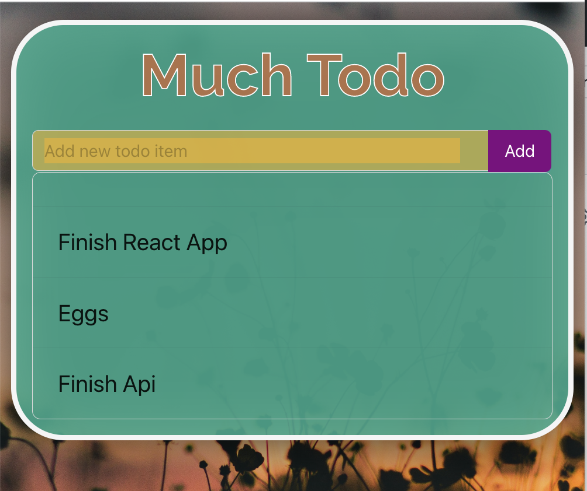

# Much To-do (Seize the Day)

Boca Code Week 5 Much To-do: A to-do app built with React and Firebase that allows users to create and manage tasks in real-time, with automatic data syncing across multiple devices.

## Features

- Create and manage tasks: Easily add and read tasks with a user-friendly interface.
- Real-time updates: Enjoy automatic data syncing across devices, keeping your to-do list up to date.
- Task prioritization: Assign priority levels to tasks for better organization and focus.

## Technologies Used

- React
- Firebase
- HTML
- JavaScript
- CSS

## How to Use

1. Clone the repository to your local machine.
2. Install the necessary dependencies using `npm install`.
3. Configure your Firebase project and obtain the required API keys.
4. Replace the Firebase configuration placeholders in the code with your own API keys.
5. Run the app using `npm start`.
6. Access the app in your web browser at `http://localhost:3000`.

## Special Thanks

- Thank you to [Boca Code](https://github.com/bocacode) for providing the learning environment, resources, and support for this project.

---

*This project was developed as part of the Boca Code curriculum.*